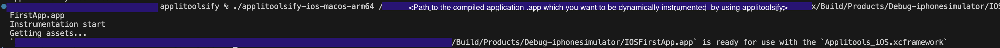
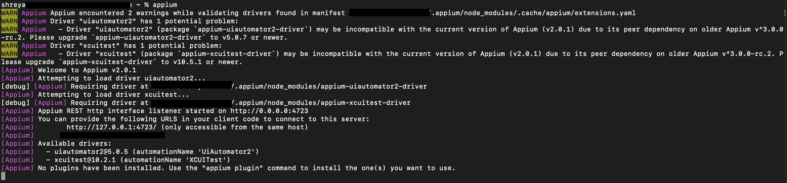
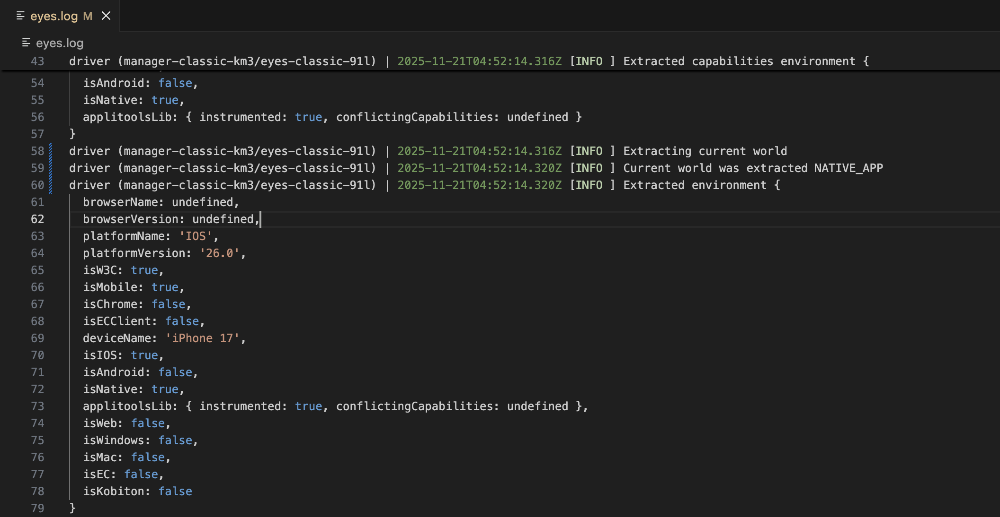
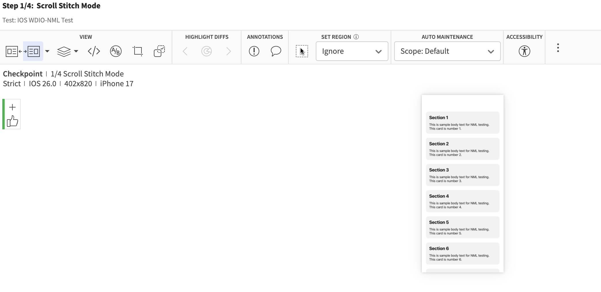
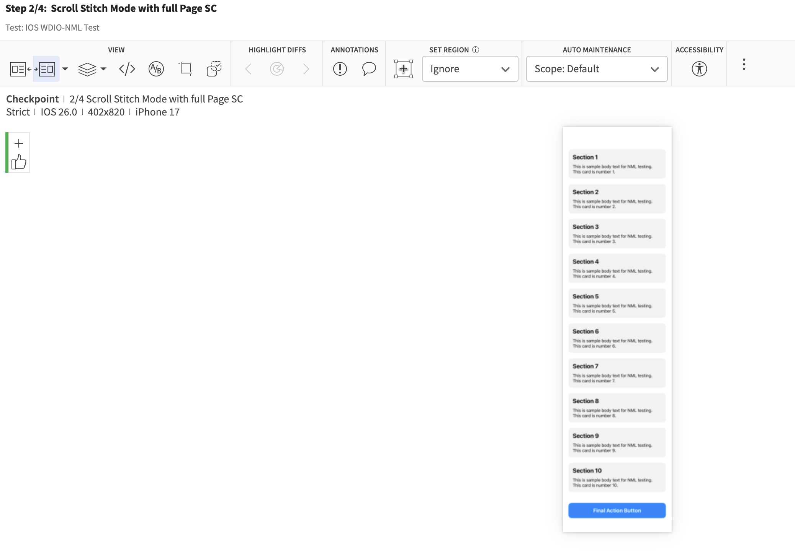
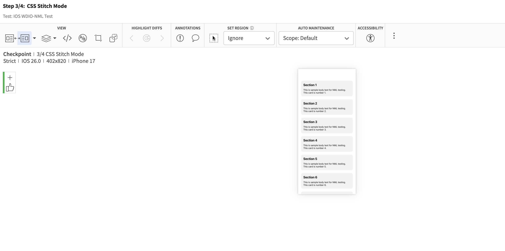
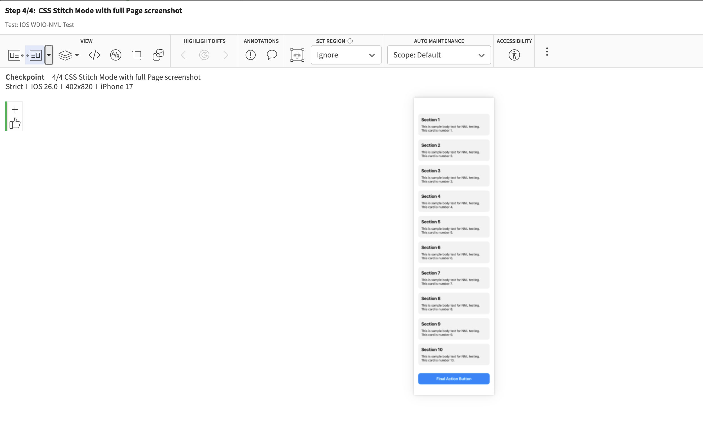

# Native Mobile Library (NML) with WDIO + Appium + Mocha (iOS – Dynamic Instrumentation)


## Introduction
The Applitools Native Mobile Library (NML) uses advanced algorithms to generate full-page screenshots of native mobile applications for validation by Eyes SDKs.

NML is embedded within the application code and captures screenshots directly from inside the application. It automatically handles scrolling when needed, ensuring an accurate screenshot without stitching issues. Additionally, system elements like the system clock or battery indicator are excluded from the image.

To use NML, you must link it with the application code. This can be done statically if you have direct access to the source code or dynamically if the application is already compiled.


There are two ways to integrate NML into an application:

| Method | Description |
|--------|-------------|
| **Static**  | Add NML into the application source before compile time |
| **Dynamic** | Inject NML into an already compiled `.app` using the `applitoolsify` tool |

This guide walks through **Dynamic Instrumentation for iOS**, followed by testing with WebdriverIO + Appium + Mocha + Eyes SDK.


## Step 1: Dynamically Instrument the iOS Application

Download the instrumenting tool ( applitoolsify ):  
👉 https://applitools.com/docs/eyes/concepts/best-practices/native-mobile-library#ios_dynamic
- applitoolsify-ios-Linux-x86_64
- applitoolsify-ios-macos-arm64
- applitoolsify-ios-macos-x86_64
- applitoolsify-ios-win-x86_64.exe

#### Give execution permissions (macOS / Linux)
```bash
chmod +x <downloaded_file_name>

chmod +x applitoolsify-ios-macos-arm64
```
#### Remove macOS quarantine (if blocked)
```bash
xattr -d com.apple.quarantine <applitooslfiy_path>

xattr -d com.apple.quarantine applitoolsify-ios-macos-arm64
```

#### Run one of the following commands, depending on your operating system:

./applitoolsify-ios-Linux-x86_64 <app/ipa file path> <br/>
./applitoolsify-ios-macos-arm64 <app/ipa file path> <br/>
./applitoolsify-ios-macos-x86_64 <app/ipa file path> <br/>
./applitoolsify-ios-win-x86_64.exe <app/ipa file path> <br/>

Optional Flag:

--local - If specified, use the local bundled NML library. Default is to fetch the latest NML library from the internet (requires internet connection)

```bash
example : ./applitoolsify-ios-macos-arm64 <Path-to-complied-ios-application-which-you-want-to-dynamically-instrument-using-applitoolsify>/IOSFirstApp.app
```


### Step 2 : Start Appium Server
- One can manually or automatically start your appium server [ In this walk through I am using manual start ]

Start Appium manually (simple)
Mac : Go to terminal
```bash 
appium
```



Ensure an iOS simulator or real device is running.

Note : If you are running on a local real device, re-sign the app. To do this, you will need a signing certificate and provisioning profile. Re-signing is not required if your target is a simulator or a real device in the cloud.

Download iOS App Signer

Install and open iOS App Signer.

Click Browse and navigate to the app you are testing.

Enter the signing certificate and provisioning profile, then click Start.

### Step 3 : Configure the SDK to use NML in your Test Code ( Configure wdio.conf.js for NML + Appium + Mocha )

Include your instrumented .app, Appium capabilities, Mocha and Eyes SDK.

```bash
//wdio.conf.js example for WDIO + Appium + Applitools NML IOS setup
const caps = Eyes.setMobileCapabilities({
    platformName: "IOS",
    maxInstances: 1,
    "appium:deviceName": "IOS_DEVICE_NAME",
    "appium:platformVersion": "PLATFORM_VERSION",
    "appium:orientation": "PORTRAIT",
    "appium:automationName": "XCUITest",
    "appium:app": "<path-towards-instrumented-IOS-application>/IOSInstrumentedApp.app", // instrumented app
    "appium:newCommandTimeout": 300,
},
process.env.APPLITOOLS_API_KEY)

exports.config = {
    runner: 'local',
    specs: [['./test/specs/**/*.js'],],
    exclude: [],
    maxInstances: 10,
    port: 4723, // Appium server port
    hostname: 'localhost',
    capabilities: [caps],
    logLevel: 'debug',
    bail: 0,
    waitforTimeout: 10000,
    connectionRetryTimeout: 120000,
    mochaOpts: {
        ui: 'bdd',
        timeout: 60000
    },
    connectionRetryCount: 3,
    services: [],
    framework: 'mocha',
    reporters: ['spec'],
}

```

### Step 4 : Run WDIO test

```bash
npx wdio run wdio.conf.js
```

### Step 5 : Confirm NML is active
In eyes.log or universal.log, look for:
```bash
applitoolsLib: { instrumented: true }
```

If true appears → the app successfully loaded NML.


### Step 6 : View the result on Eyes Dashboard







Additional Pointers which maybe of your help

#### How to find your build/compile file ?
1. Open your project in Xcode
2. In the top menu, click: Product → Show Build Folder in Finder
3. Navigate towards Build/Products/Debug-iphonesimulator/ --> Inside, you will see compiled/build version of your application ( example : IOSFirstApp.app )